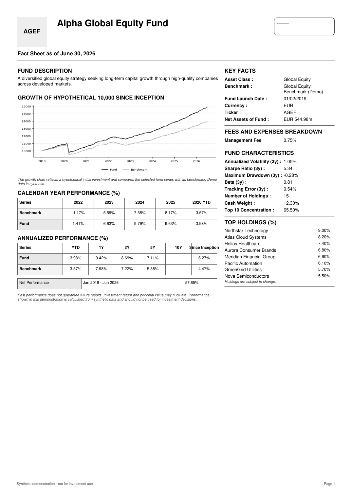
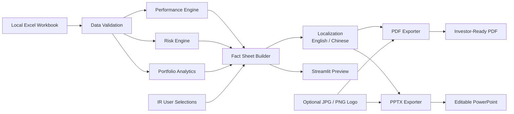

# IR Fund Fact Sheet Generator

A local Python-based Investor Relations reporting tool that converts structured Excel fund data into standardized fund fact sheets.

The application calculates performance, risk and portfolio analytics, lets users choose which metrics to display, supports English and Chinese output, accepts a custom logo, and exports either a distribution-ready PDF or a fully editable PowerPoint.

> All data in this repository is synthetic. The project is designed as a portfolio demonstration, not as investment advice or a production reporting system.

## 中文简介

这是一个基于 Python 开发的本地 Investor Relations（投资者关系）报告自动化工具，可将结构化的 Excel 基金数据自动转换为标准化的基金 Fact Sheet。

该工具可自动完成基金业绩、风险指标及投资组合数据分析，并允许用户自主选择需要展示的指标和报告内容。同时支持中英文输出、自定义 Logo，以及生成可直接用于展示或分发的 PDF 和可进一步编辑的 PowerPoint 文件。

> 本项目中的所有数据均为合成演示数据，仅用于个人作品集及技术展示，不构成任何投资建议，也不代表可直接用于实际业务的生产级报告系统。
> 


## Why I built this

IR teams often repeat the same reporting tasks across funds and reporting dates. The raw data may already exist in Excel, but performance tables, risk metrics, portfolio summaries, charts and formatting still require repeated manual work.

This project demonstrates a workflow in which Excel remains the controlled input source while Python handles validation, calculation and report generation.

## Main workflow



## Features

### Data input and controls

- Use the bundled demo workbook or upload a local `.xlsx` workbook
- Select fund and reporting date
- Validate required sheets, fields, duplicate records, fund IDs and portfolio weights
- Keep source data local to the Streamlit session

### Performance

Users can choose which sections appear in the fact sheet.

- Custom-period net performance
- YTD
- 1-year return
- 3-year, 5-year and 10-year annualized return when history is sufficient
- Since-inception performance
- Calendar-year performance
- Growth of an initial 10,000 investment

### Risk metrics

The calculation engine supports more metrics than the report needs to display. The user selects the metrics that should appear.

- Annualized volatility
- Sharpe ratio
- Maximum drawdown
- Beta
- Tracking error
- Information ratio

Risk periods can be 1Y, 3Y, 5Y, since inception or a custom date range. When Sharpe Ratio is selected, the user can enter the annual risk-free rate.

### Portfolio analytics

- Top holdings
- Number of holdings
- Top 10 concentration
- Sector allocation
- Country allocation
- Asset-class allocation
- Cash weight

### Branding, localization and export

- Upload a `.jpg`, `.jpeg` or `.png` logo in the web app
- Logo is validated and normalized locally
- Maximum upload size is 5 MB
- Aspect ratio is preserved
- The logo appears in the upper-right corner of page 1 only
- Generate reports in English or Chinese
- Standard financial terminology uses controlled translations
- Narrative text can optionally be translated using an LLM through OpenRouter
- Calculated figures, dates, fund identifiers and portfolio weights are not modified by the translation layer
- Export a fixed-layout investor-ready PDF
- Export a fully editable PowerPoint version
- PowerPoint text boxes, tables, lines, charts and logo can be moved and edited manually
- Both PDF and PowerPoint follow the user's selected sections and metrics

## Repository structure

```text
IR_Fund_Fact_Sheet_Generator/
├── app.py
├── validate_workbook.py
├── generate_demo_pdf.py
├── requirements.txt
├── requirements-dev.txt
├── run_app.bat
├── run_app.sh
├── data/
│   └── IR_Fund_Fact_Sheet_Input_Template.xlsx
├── assets/
│   └── demo_logo.png
├── examples/
│   └── Example_Fund_Fact_Sheet.pdf
├── docs/
│   └── example_fact_sheet_page1.png
├── src/
│   ├── data_loader.py
│   ├── performance.py
│   ├── risk_metrics.py
│   ├── portfolio.py
│   ├── metric_catalog.py
│   ├── factsheet_builder.py
│   ├── branding.py
│   └── pdf_exporter.py
└── tests/
    └── test_project.py
```

## Quick start

### 1. Create a virtual environment

Windows:

```bash
python -m venv .venv
.venv\Scripts\activate
```

macOS / Linux:

```bash
python -m venv .venv
source .venv/bin/activate
```

### 2. Install dependencies

```bash
pip install -r requirements.txt
```

### 3. Run the local web app

```bash
python -m streamlit run app.py
```

The application should open at a local address such as `http://localhost:8501`.

Windows users can also double-click `run_app.bat` after installing the dependencies.

## Excel input model

The workbook contains four operational sheets plus documentation sheets.

### `Fund_Master`

Slow-changing fund information such as fund name, benchmark, launch date, currency, fee, description, manager, performance basis and benchmark return convention.

### `NAV_History`

Daily fund NAV, benchmark value and AUM. This is the main source for performance and risk calculations.

### `Holdings`

Portfolio snapshot by security, sector, country, asset class and weight.

### `Fund_Stats`

Reporting-date information such as shares outstanding, subscriptions, redemptions and cash weight.

## Calculation design

The project deliberately separates raw input from calculated output.

For example, the Excel file supplies NAV history. Python calculates the 1Y return, annualized multi-year performance, volatility, drawdown and other metrics. This avoids manually maintaining the same derived figures in multiple places.

The web app does not duplicate financial formulas. `factsheet_builder.py` calls the calculation modules, and both the web preview and PDF exporter use the same assembled data.

## Important methodology notes

- Annualized volatility and tracking error use 252 trading days per year.
- Multi-year returns use compound annualization based on the actual dates used.
- Missing 5Y or 10Y history returns `N/A` instead of inventing a value.
- The demo treats NAV as a synthetic net-of-fee performance series.
- A production system should use the administrator-approved total-return or adjusted NAV series when distributions must be reinvested.
- Benchmark methodology should match the firm's approved reporting convention.

## Local processing and confidentiality

The intended use case is a local Streamlit application. A workbook uploaded in the app is written only to a temporary local file so the Excel reader can load it, and that temporary file is removed immediately afterwards.

In a real asset manager, additional controls would still be required, including user permissions, audit logging, approved data sources, controlled legal text, versioning and compliance review.

## Production improvements I would make next

- Connect to the firm's approved fund administrator or data warehouse instead of manual Excel upload
- Add share-class handling and reporting-currency conversion
- Store compliance-approved disclosures in a controlled template library
- Add role-based access and audit history
- Add automated reconciliation against an official monthly performance file
- Add corporate template configuration without changing Python code
- Add scheduled generation for recurring monthly fact sheets

## Testing

Install development dependencies and run:

```bash
pip install -r requirements-dev.txt
python -m pytest -q
```

The tests cover workbook validation, selected metric assembly, insufficient-history handling and PDF generation.

## Interview summary

A concise way to present the project:

> I built a local Python prototype for automating an IR fund fact-sheet workflow. The system reads validated Excel data, calculates fund and benchmark performance, risk metrics and portfolio analytics, lets the IR user choose which metrics should appear, and produces a branded PDF. I kept calculation logic separate from the Streamlit interface and PDF layer so the preview and final report use the same numbers. For production use, I would connect it to administrator-approved data and compliance-controlled disclosures.

## License

MIT. See `LICENSE`.


## PDF export

The PDF uses a compact institutional layout inspired by the supplied iShares fact sheet structure. Page 1 uses an asymmetric two-column design with thin black section rules. The wider left column contains the fund description, growth chart, calendar-year performance and annualized performance. The narrower right column contains key facts, fees, selected risk characteristics and top holdings. Page 2 continues with a two-column glossary and portfolio allocations, followed by full-width important information.

The uploaded company or fund logo is placed in the upper-right corner of the header. A ticker block appears in the upper-left when a ticker is available. The design intentionally follows the source document's information hierarchy while using synthetic content and generic branding.


## English / Chinese output

The web app lets the IR user choose **English** or **Simplified Chinese** before export.

The Chinese reporting layer is deliberately split into two parts:

- Standard fund-reporting labels and common financial terms use a fixed translation dictionary in `src/localization.py`.
- Narrative text such as a fund description can optionally use an OpenRouter API key and model ID. If no key is supplied, the bundled demo descriptions still use deterministic Chinese translations; unknown narrative text remains in the source language rather than being guessed.

Calculated numbers are never sent to the LLM. NAV, performance, risk metrics, weights, dates, tickers, ISINs and other numeric/identifier fields come directly from the same Python objects used by the English report.

For real production use, compliance-sensitive legal disclosures should come from approved bilingual templates rather than dynamic LLM translation.

## Editable PowerPoint export

The application offers two download formats for the selected language:

- **PDF** for a distribution-ready fixed-layout fact sheet.
- **PowerPoint (.pptx)** for a fully editable A4 portrait report.

The PowerPoint intentionally mirrors the approved iShares-style layout. Page 1 uses the same asymmetric two-column structure, black section rules, compact key facts, selected risk characteristics and top holdings. Page 2 contains glossary, allocation and important-information sections.

In the PowerPoint output, text boxes, section titles, separator lines, tables and charts are native PowerPoint objects. They can be moved, resized, recolored or rewritten after generation. The performance chart is a native editable chart rather than a flattened screenshot. The uploaded logo remains an image object that can be moved or resized.

The same `factsheet_builder.py` data is used by both exporters, so editing flexibility does not create a second set of financial calculations.

## Translation / export architecture

```text
Excel data
   ↓
validation + calculation modules
   ↓
factsheet_builder.py
   ↓
localization.py
   ↓
┌─────────────────────┬─────────────────────┐
│ pdf_exporter.py     │ pptx_exporter.py    │
│ fixed-layout PDF    │ editable PowerPoint │
└─────────────────────┴─────────────────────┘
          ↓                    ↓
      English / 中文       English / 中文
```

If OpenRouter is enabled, only designated narrative strings are sent to the external API. Firms should enable that option only when their data-governance and compliance policies permit external model processing.
