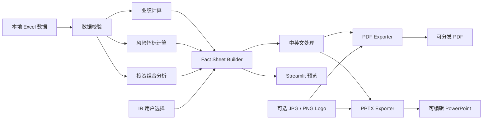
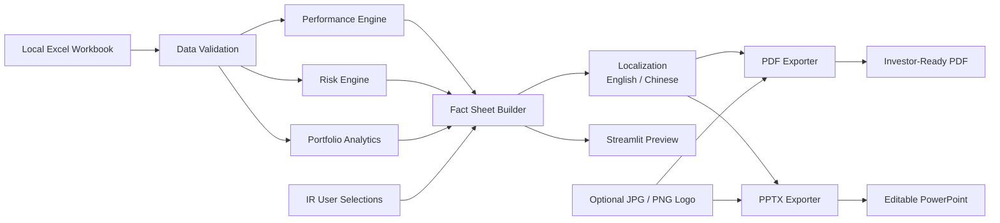

# IR Fund Fact Sheet Generator

[中文说明](#中文说明) | [English Documentation](#english-documentation)

## 中文说明

这是一个基于 **Python + Streamlit** 开发的本地 Investor Relations（投资者关系）报告自动化工具，用于将结构化 Excel 基金数据转换为标准化的基金概览（Fund Fact Sheet）。

工具可自动完成数据校验、基金业绩计算、风险指标计算和投资组合分析，并允许 IR 用户自主选择需要展示的指标和报告内容。同时支持中英文输出、自定义 Logo，以及生成可直接分发的 PDF 和可进一步编辑的 PowerPoint 文件。

> 本项目中的所有数据均为合成演示数据，仅用于个人作品集及技术展示，不构成任何投资建议，也不代表可直接用于实际业务的生产级报告系统。


## 为什么做这个项目

在基金 IR 和定期报告工作中，底层数据通常已经存在于 Excel 或内部系统中，但不同基金、不同报告期仍需要重复完成数据检查、业绩表更新、风险指标计算、持仓分析、图表制作和报告排版。

因此，我希望通过 Python 将这些重复步骤标准化和自动化，同时保留 IR 用户对最终展示内容的选择权。项目以 Excel 作为可控数据输入，由 Python 负责数据校验、计算和报告生成。

## 核心工作流



## 主要功能

### 数据输入与控制

- 使用内置 Demo Workbook，或上传本地 `.xlsx` 文件
- 选择基金和报告日期
- 校验必需工作表、字段、重复记录、Fund ID 和持仓权重
- 上传数据仅在本地 Streamlit 会话中处理

### 业绩分析

用户可以选择需要展示在 Fact Sheet 中的业绩模块：

- 自定义区间净收益
- YTD
- 1 年收益
- 3 年、5 年及 10 年年化收益（历史数据充足时）
- 成立以来收益
- 年度业绩表现
- 初始投资 10,000 的增长曲线

### 风险指标

- 年化波动率
- Sharpe Ratio
- Maximum Drawdown
- Beta
- Tracking Error
- Information Ratio

风险测算区间可选 1Y、3Y、5Y、成立以来或自定义区间；选择 Sharpe Ratio 时可输入年化无风险利率。

### 投资组合分析

- 主要持仓
- 持仓数量
- 前十大持仓集中度
- 行业配置
- 国家 / 地区配置
- 资产类别配置
- 现金占比

### 品牌、中英文与输出

- 上传 `.jpg`、`.jpeg` 或 `.png` Logo
- 保留 Logo 原始宽高比，并放置于报告首页右上角
- 支持英文和简体中文报告
- 标准金融术语采用固定翻译词典，保证术语一致性
- 基金简介等叙述性文本可通过 OpenRouter 调用大语言模型辅助翻译
- 计算结果、日期、基金标识、NAV、权重等数据不会由大语言模型重新生成
- 输出固定版式 PDF
- 输出可编辑 PowerPoint，文字、表格、图表、分隔线及 Logo 均可进一步调整

## 快速开始

### 1. 创建虚拟环境

Windows：

```bash
python -m venv .venv
.venv\Scripts\activate
```

macOS / Linux：

```bash
python -m venv .venv
source .venv/bin/activate
```

### 2. 安装依赖

```bash
pip install -r requirements.txt
```

### 3. 启动本地 Web 应用

```bash
python -m streamlit run app.py
```

应用通常会在本地地址打开，例如：`http://localhost:8501`。

Windows 用户在完成依赖安装后，也可双击 `run_app.bat` 启动。

## 设计原则

项目将原始数据与计算结果分离。例如，Excel 仅提供 NAV 历史数据，Python 再计算 1Y 收益、长期年化收益、波动率、回撤及其他风险指标，避免在多个位置重复维护同一组派生数据。

`factsheet_builder.py` 统一调用各计算模块，网页预览、PDF 和 PowerPoint 均基于同一套已组装数据，避免不同输出之间出现两套金融计算逻辑。

大语言模型仅用于指定的叙述性文本翻译，不参与基金业绩、风险指标、持仓权重或其他金融数值的计算。

## 方法论与数据说明

- 年化波动率和 Tracking Error 使用每年 252 个交易日
- 多年收益根据实际日期进行复合年化
- 历史数据不足时，5Y 或 10Y 指标显示 `N/A`，不会人为补值
- Demo 将 NAV 视为合成的费后业绩序列
- 真实生产环境应使用经基金管理人 / 管理机构确认的 total-return 或 adjusted NAV 数据
- Benchmark 方法应与机构正式报告口径保持一致

## 本地处理与合规说明

本项目定位为本地 Streamlit 应用。上传的 Excel 文件仅用于本地临时读取，处理完成后临时文件会被删除。

如用于真实资产管理机构，还需要进一步加入用户权限、审计日志、正式数据源、受控法律文本、版本管理和合规审核等控制。

## 后续可扩展方向

- 对接基金管理机构或内部 Data Warehouse，替代手工 Excel 上传
- 增加 Share Class 和报告币种转换
- 建立 Compliance-approved disclosure 模板库
- 增加基于角色的权限控制和审计记录
- 与官方月度业绩文件进行自动 reconciliation
- 将企业模板配置与 Python 代码解耦
- 支持定期批量生成月度 / 季度 Fact Sheet

---

# English Documentation

## Overview

A local Python-based Investor Relations reporting tool that converts structured Excel fund data into standardized fund fact sheets.

The application calculates performance, risk and portfolio analytics, lets users choose which metrics to display, supports English and Chinese output, accepts a custom logo, and exports either a distribution-ready PDF or a fully editable PowerPoint.

> All data in this repository is synthetic. The project is designed as a portfolio demonstration, not as investment advice or a production reporting system.

## Why I built this

IR teams often repeat the same reporting tasks across funds and reporting dates. The raw data may already exist in Excel, but performance tables, risk metrics, portfolio summaries, charts and formatting still require repeated manual work.

This project demonstrates a workflow in which Excel remains the controlled input source while Python handles validation, calculation and report generation.

## Main workflow



## Features

### Data input and controls

- Use the bundled demo workbook or upload a local `.xlsx` workbook
- Select fund and reporting date
- Validate required sheets, fields, duplicate records, fund IDs and portfolio weights
- Keep source data local to the Streamlit session

### Performance

Users can choose which sections appear in the fact sheet.

- Custom-period net performance
- YTD
- 1-year return
- 3-year, 5-year and 10-year annualized return when history is sufficient
- Since-inception performance
- Calendar-year performance
- Growth of an initial 10,000 investment

### Risk metrics

The calculation engine supports more metrics than the report needs to display. The user selects the metrics that should appear.

- Annualized volatility
- Sharpe ratio
- Maximum drawdown
- Beta
- Tracking error
- Information ratio

Risk periods can be 1Y, 3Y, 5Y, since inception or a custom date range. When Sharpe Ratio is selected, the user can enter the annual risk-free rate.

### Portfolio analytics

- Top holdings
- Number of holdings
- Top 10 concentration
- Sector allocation
- Country allocation
- Asset-class allocation
- Cash weight

### Branding, localization and export

- Upload a `.jpg`, `.jpeg` or `.png` logo in the web app
- Logo is validated and normalized locally
- Maximum upload size is 5 MB
- Aspect ratio is preserved
- The logo appears in the upper-right corner of page 1 only
- Generate reports in English or Chinese
- Standard financial terminology uses controlled translations
- Narrative text can optionally be translated using an LLM through OpenRouter
- Calculated figures, dates, fund identifiers and portfolio weights are not modified by the translation layer
- Export a fixed-layout investor-ready PDF
- Export a fully editable PowerPoint version
- PowerPoint text boxes, tables, lines, charts and logo can be moved and edited manually
- Both PDF and PowerPoint follow the user's selected sections and metrics

## Repository structure

```text
IR_Fund_Fact_Sheet_Generator/
├── app.py
├── validate_workbook.py
├── generate_demo_pdf.py
├── generate_demo_outputs.py
├── requirements.txt
├── requirements-dev.txt
├── run_app.bat
├── run_app.sh
├── data/
│   └── IR_Fund_Fact_Sheet_Input_Template.xlsx
├── assets/
│   └── demo_logo.png
├── examples/
│   ├── Example_Fund_Fact_Sheet.pdf
│   ├── Example_Fund_Fact_Sheet_EN.pdf
│   ├── Example_Fund_Fact_Sheet_EN.pptx
│   ├── Example_Fund_Fact_Sheet_ZH.pdf
│   └── Example_Fund_Fact_Sheet_ZH.pptx
├── docs/
│   └── example_fact_sheet_page1.png
├── src/
│   ├── data_loader.py
│   ├── performance.py
│   ├── risk_metrics.py
│   ├── portfolio.py
│   ├── metric_catalog.py
│   ├── factsheet_builder.py
│   ├── branding.py
│   ├── localization.py
│   ├── pdf_exporter.py
│   └── pptx_exporter.py
└── tests/
    ├── conftest.py
    └── test_project.py
```

## Quick start

### 1. Create a virtual environment

Windows:

```bash
python -m venv .venv
.venv\Scripts\activate
```

macOS / Linux:

```bash
python -m venv .venv
source .venv/bin/activate
```

### 2. Install dependencies

```bash
pip install -r requirements.txt
```

### 3. Run the local web app

```bash
python -m streamlit run app.py
```

The application should open at a local address such as `http://localhost:8501`.

Windows users can also double-click `run_app.bat` after installing the dependencies.

## Excel input model

The workbook contains four operational sheets plus documentation sheets.

### `Fund_Master`

Slow-changing fund information such as fund name, benchmark, launch date, currency, fee, description, manager, performance basis and benchmark return convention.

### `NAV_History`

Daily fund NAV, benchmark value and AUM. This is the main source for performance and risk calculations.

### `Holdings`

Portfolio snapshot by security, sector, country, asset class and weight.

### `Fund_Stats`

Reporting-date information such as shares outstanding, subscriptions, redemptions and cash weight.

## Calculation design

The project deliberately separates raw input from calculated output.

For example, the Excel file supplies NAV history. Python calculates the 1Y return, annualized multi-year performance, volatility, drawdown and other metrics. This avoids manually maintaining the same derived figures in multiple places.

The web app does not duplicate financial formulas. `factsheet_builder.py` calls the calculation modules, and the web preview, PDF exporter and PowerPoint exporter use the same assembled data.

## Important methodology notes

- Annualized volatility and tracking error use 252 trading days per year.
- Multi-year returns use compound annualization based on the actual dates used.
- Missing 5Y or 10Y history returns `N/A` instead of inventing a value.
- The demo treats NAV as a synthetic net-of-fee performance series.
- A production system should use the administrator-approved total-return or adjusted NAV series when distributions must be reinvested.
- Benchmark methodology should match the firm's approved reporting convention.

## Local processing and confidentiality

The intended use case is a local Streamlit application. A workbook uploaded in the app is written only to a temporary local file so the Excel reader can load it, and that temporary file is removed immediately afterwards.

In a real asset manager, additional controls would still be required, including user permissions, audit logging, approved data sources, controlled legal text, versioning and compliance review.

## Production improvements I would make next

- Connect to the firm's approved fund administrator or data warehouse instead of manual Excel upload
- Add share-class handling and reporting-currency conversion
- Store compliance-approved disclosures in a controlled template library
- Add role-based access and audit history
- Add automated reconciliation against an official monthly performance file
- Add corporate template configuration without changing Python code
- Add scheduled generation for recurring monthly fact sheets

## Testing

Install development dependencies and run:

```bash
pip install -r requirements-dev.txt
python -m pytest -q
```

The tests cover workbook validation, selected metric assembly, insufficient-history handling and PDF generation.

## PDF export

The PDF uses a compact institutional layout inspired by the supplied iShares fact sheet structure. Page 1 uses an asymmetric two-column design with thin black section rules. The wider left column contains the fund description, growth chart, calendar-year performance and annualized performance. The narrower right column contains key facts, fees, selected risk characteristics and top holdings. Page 2 continues with a two-column glossary and portfolio allocations, followed by full-width important information.

The uploaded company or fund logo is placed in the upper-right corner of the header. A ticker block appears in the upper-left when a ticker is available. The design intentionally follows the source document's information hierarchy while using synthetic content and generic branding.

## English / Chinese output

The web app lets the IR user choose **English** or **Simplified Chinese** before export.

The Chinese reporting layer is deliberately split into two parts:

- Standard fund-reporting labels and common financial terms use a fixed translation dictionary in `src/localization.py`.
- Narrative text such as a fund description can optionally use an OpenRouter API key and model ID. If no key is supplied, the bundled demo descriptions still use deterministic Chinese translations; unknown narrative text remains in the source language rather than being guessed.

Calculated numbers are never sent to the LLM. NAV, performance, risk metrics, weights, dates, tickers, ISINs and other numeric/identifier fields come directly from the same Python objects used by the English report.

For real production use, compliance-sensitive legal disclosures should come from approved bilingual templates rather than dynamic LLM translation.

## Editable PowerPoint export

The application offers two download formats for the selected language:

- **PDF** for a distribution-ready fixed-layout fact sheet.
- **PowerPoint (.pptx)** for a fully editable A4 portrait report.

The PowerPoint mirrors the same two-column information hierarchy used by the PDF. Page 1 contains the core fund description, performance content, key facts, selected risk characteristics and top holdings. Page 2 contains glossary, allocation and important-information sections.

In the PowerPoint output, text boxes, section titles, separator lines, tables and charts are native PowerPoint objects. They can be moved, resized, recolored or rewritten after generation. The performance chart is a native editable chart rather than a flattened screenshot. The uploaded logo remains an image object that can be moved or resized.

The same `factsheet_builder.py` data is used by both exporters, so editing flexibility does not create a second set of financial calculations.

## Translation / export architecture

```text
Excel data
   ↓
validation + calculation modules
   ↓
factsheet_builder.py
   ↓
localization.py
   ↓
┌─────────────────────┬─────────────────────┐
│ pdf_exporter.py     │ pptx_exporter.py    │
│ fixed-layout PDF    │ editable PowerPoint │
└─────────────────────┴─────────────────────┘
          ↓                    ↓
      English / 中文       English / 中文
```

If OpenRouter is enabled, only designated narrative strings are sent to the external API. Firms should enable that option only when their data-governance and compliance policies permit external model processing.

## License

MIT. See `LICENSE`.
